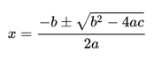

# Trabajo Práctico 5

## Completar el trabajo práctico en GitHub Classroom
[Link al TP 5](https://classroom.github.com/a/RR7GF3-o)


## Ejercicio 1 - Cálculo de los máximos

Para este ejercicio deberan implementar las funciones dadas para que cumplan con su objetivo. Para saber como implementar cada metodo, deberan leer el python-doc.

```python
def max_of_two(x, y):
    """Given x and y, that are 2 numbers, return the biggest number."""
    return "ANSWER HERE" # Remove this line and implement

def max_of_three(x, y, z):
    """Given x, y and z, that are 3 numbers, return the biggest number of the three."""
    return "ANSWER HERE" # Remove this line and implement
```

Ejemplos: 
```python
max_of_two(5,4) # Retorna: 5

max_of_two(-2,-3) # Retorna: -2

max_of_two(0,0) # Retorna: 0

max_of_three(5,4,7) # Retorna: 7

max_of_three(-2,-3,-1) # Retorna: -1

max_of_three(0,0,0) # Retorna: 0
```


## Ejercicio 2 - Months

Para este ejercicio se debe implementar la función `number_to_month` que dado un número entre el 1 y el 12, retorne el nombre del mes que representa en el calendario.
Si el número no está entre el rango 1 y 12, se debera retornar la palabra "error".

```python
def number_to_month(month):
    return "ANSWER HERE" # Remove this line and implement
```

Todos los meses deberán ser en minuscula.

Ejemplos:
```python
number_to_month(1) # Retorna: "enero"
number_to_month(2) # Retorna: "diciembre"
number_to_month(99) # Retorna: "error"
```


## Ejercicio 3 - Quadratic

Completar, definir e implementar los métodos necesarios para resolver una ecuación cuadrática de 2º grado. Para ello, lo que deberán hacer es crear todos los siguentes métodos:

* Dado los parámetros (a, b, c) el método roots devolverá un String de la forma "(r1, r2)" o "(r12)" o "( )" según sea el caso de que tenga dos raíces, una raíz o ninguna.
* Dado los parámetros (a, b, c, x) el método value_y devolverá el valor de Y para un valor de X que se le pasa como parámetro.
* Dado los parámetros (a, b, c) el método to_string que devolverá un String mostrando la ecuación "f(x) = A * X^2 + B * X + C" reemplazando los valores de a, b y c.
* Dado los parámetros (a, b, c) el método derivation que devolverá un String mostrando la función lineal que resulta de derivar la función cuadrática.

```python
# Replace the "ANSWER HERE" for your answer

def roots(a, b, c):
    return "ANSWER HERE"

def value_y(a, b, c, x):
    return "ANSWER HERE"

def to_string(a, b, c):
    return "ANSWER HERE"

def derivation(a, b):
    return "ANSWER HERE"
```

HINT: Para resolver una cuadrática:



Ejemplos:
```python
roots(1, -3, 2) # Retorna: "(2.0, 1.0)"
roots(1, -2, 1) # Retorna: "(1.0)"
roots(1, 2, 3)  # Retorna: "( )"

value_y(1, -3, 2, 0) # Retorna: 2
value_y(1, -3, 2, 1) # Retorna: 0
value_y(1, -3, 2, -1) # Retorna: 6

to_string(2, -3, 1) # Retorna: "f(x) = 2 * X^2 + -3 * X + 1"

derivation(2, -3, 1) # Retorna: "f'(x) = 4x + -3"
```
