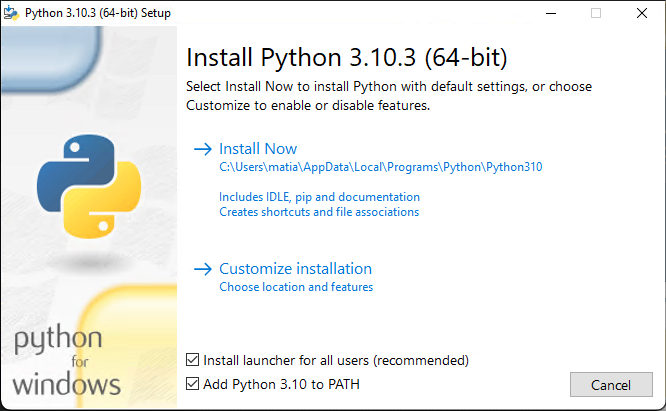

# Python Installation

## Python on OS X

### Installing Homebrew
Homebrew is a package manager for OS X ( and Linux )
Open a terminal window by going to Launchpad -> Other -> Terminal. You can also press command-spacebar, type terminal, and then press enter. Then paste the following command in the terminal
```commandline
/bin/bash -c "$(curl -fsSL https://raw.githubusercontent.com/Homebrew/install/HEAD/install.sh)"
```
( Enter to https://brew.sh/ for more information about Homebrew )

After downloading and installing Homebrew with the previous command you can install python3 by writing the command 
```commandline
brew install python3
```

Finally, you can check the python version installed with
```commandline
$ python3
Python 3.9.10 (main, Jan 15 2022, 11:48:00)
[Clang 13.0.0 (clang-1300.0.29.3)] on darwin
Type "help", "copyright", "credits" or "license" for more information.
>>>
```

When you’ve seen this output, press ctrl-D or enter exit&#40;&#41; to leave the Python prompt and return to a terminal prompt.


## Python on Linux

Open a terminal window by running the Terminal application on your system &#40;in Ubuntu, you can press ctrl-alt-T&#41;. Then run the following commands
```commandline
sudo apt-get update
sudo apt-get install python3
```

Finally, you can check the python version installed with
```commandline
$ python3
Python 3.9.10 (main, Jan 15 2022, 11:48:00)
[Clang 13.0.0 (clang-1300.0.29.3)] on darwin
Type "help", "copyright", "credits" or "license" for more information.
>>>

```

When you’ve seen this output, press ctrl-D or enter exit&#40;&#41; to leave the Python prompt and return to a terminal prompt.

[//]: # ()
[//]: # (This output means you also have Python 3 installed, so you’ll be)

[//]: # (able to use either version. Whenever you see the python command in this book, enter python3 instead. Most Linux distributions have Python already installed, but if for some reason yours didn’t or if your system came with Python 2 and you want to install Python 3, refer to Appendix A.)


## Python on Windows
Windows doesn’t always come with Python, so you’ll probably need to download and install it, and then download and install a text editor.
    
First, check whether Python is installed on your system. Open a command window by entering command into the Start menu or by holding down the shift key while right-clicking on your desktop and selecting Open command window here. In the terminal window, enter python in lowercase. If you get a Python prompt (>>>), Python is installed on your system. However, you’ll probably see an error message telling you that python is not a recognized command or the Microsoft Store application loading.
In that case, download a Python installer for Windows. Go to http://python.org/downloads/. Click the `Download Python 3.10.3` button, which should automatically start downloading the correct installer for your system. After you’ve downloaded the file, run the installer. Make sure you check the option Add Python to PATH, which will make it easier to config- ure your system correctly.




Open a command window and enter python in lowercase. If you get a Python prompt (>>>), Windows has found the version of Python you just installed:
```commandline
C:\> python
Python 3.10.3 (tags/v3.10.3:a342a49, Mar 16 2022, 13:07:40) [MSC v.1929 64 bit (AMD64)] on win32
Type "help", "copyright", "credits" or "license" for more information.
```

When you’ve seen this output, press ctrl-Z or enter exit&#40;&#41; to leave the Python prompt and return to a terminal prompt.


## SublimeText Installation

### Using download link
Enter to http://www.sublimetext.com/ and download the App installer 

### Using Homebrew for OS X
```commandline
brew install --cask sublime-text
```
### Using apt-get for Linux
```commandline
sudo apt-get update
sudo apt-get install sublime-text
```
